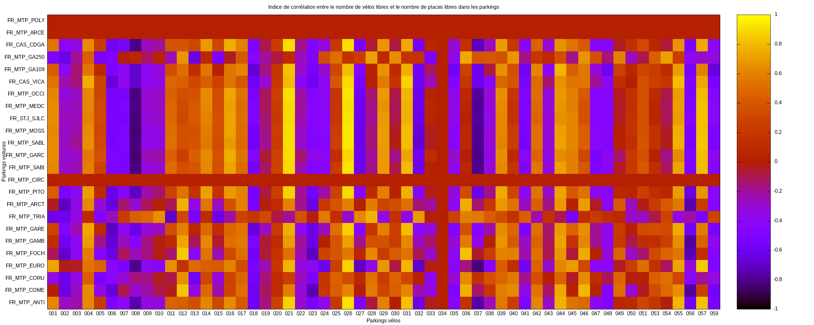
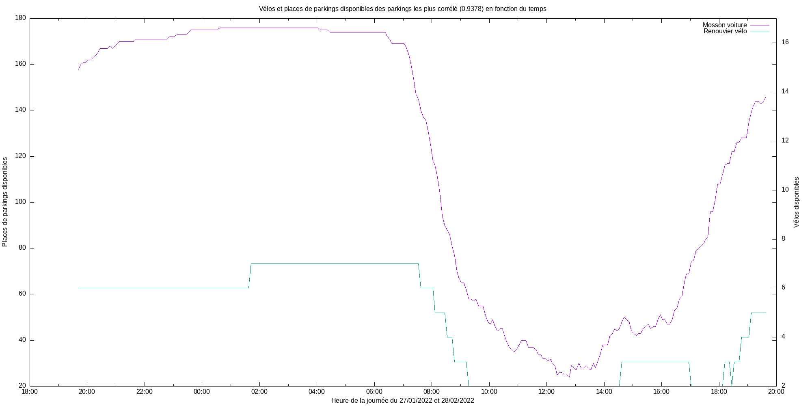

# Présentation des données

- [Présentation des données](#présentation-des-données)
  - [**Emplacement**](#emplacement)
    - [**Données brutes :**](#données-brutes-)
    - [**Données traités :**](#données-traités-)
  - [**Analyse**](#analyse)
    - [**Définitions**](#définitions)
      - [Facteur de corrélation](#facteur-de-corrélation)
      - [Ecart Type](#ecart-type)
    - [**Correspondances parkings vélos**](#correspondances-parkings-vélos)
    - [**Carte de températures**](#carte-de-températures)
    - [**Les plus corrélé**](#les-plus-corrélé)

## **Emplacement**
### **Données brutes :**
Toutes les données brutes sont disponibles dans le repertoires databrutes sous format CSV.

### **Données traités :**
Les données les plus interessantes sont dans le fichier [compte_rendu.txt](./compte_rendu.txt), il contient pour chaque parkings :
1. Le nombre de places/vélos disponible au maximum
2. La moyenne de places/vélos libres
3. Le pourcentage de places/vélos libres sur 24H
4. L'écart type à cette moyenne 

Les mêmes données pour tout l'essemble de parkings voiture et l'enssemble des parkings vélos sont à la fin du compte rendu.

## **Analyse**
### **Définitions**
#### Facteur de corrélation
Peut démontrer une corrélation entre deux courbes, si elles évoluent dans le même sens le facteur se rapproche de 1, si elles évoluent dans des sens contraire le facteur se rapproche de -1 et si elle n'ont rien à voir le facteur se rapproche de 0. C'est un outils qui permet un analyse, il ne démontre en aucun cas une corrélation à 100%.

#### Ecart Type 
Complémentaire à la moyenne il permet de savoir comment les valeurs sont dispersé autour de cette moyenne. Une courbe avec un écart type élevé aura plus de fluctuations autour de la moyenne qu'une courbe avec la même moyenne mais un écart type plus petit.

### **Correspondances parkings vélos**
001|002|003|004|005|006|007|008|009|010|011|012|013|014|015|016|017|018|019|020|021|022|023|024|025|026|027|028|029|030|031|032|033|034|035|036|037|038|039|040|041|042|043|044|045|046|047|048|049|050|051|053|054|055|056|057|059
-|-|-|-|-|-|-|-|-|-|-|-|-|-|-|-|-|-|-|-|-|-|-|-|-|-|-|-|-|-|-|-|-|-|-|-|-|-|-|-|-|-|-|-|-|-|-|-|-|-|-|-|-|-|-|-|-
Rue Jules Ferry - Gare Saint-Roch vélo|Comédie vélo|Esplanade vélo|Hôtel de Ville vélo|Corum vélo|Place Albert 1er - St Charles vélo|Foch vélo|Halles Castellane vélo|Observatoire vélo|Rondelet vélo|Plan Cabanes vélo|Boutonnet vélo|Emile Combes vélo|Beaux-Arts vélo|Les Aubes vélo|Antigone centre vélo|Médiathèque Emile Zola vélo|Nombre d'Or vélo|Louis Blanc vélo|Gambetta vélo|Port Marianne vélo|Clemenceau vélo|Les Arceaux vélo|Cité Mion vélo|Nouveau Saint-Roch vélo|Renouvier vélo|Odysseum vélo|Saint-Denis vélo|Richter vélo|Charles Flahault vélo|Voltaire vélo|Prés d'Arènes vélo|Garcia Lorca vélo|Vert Bois vélo|Malbosc vélo|Occitanie vélo|FacdesSciences vélo|Fac de Lettres vélo|Aiguelongue vélo|Jeu de Mail des Abbés vélo|Euromédecine vélo|Marie Caizergues vélo|Sabines vélo|Celleneuve vélo|Jardin de la Lironde vélo|Père Soulas vélo|Place Viala vélo|Hôtel du Département vélo|Tonnelles vélo|Parvis Jules Ferry - Gare Saint-Roch vélo|Pont de Lattes - Gare Saint-Roch vélo|Deux Ponts - Gare Saint-Roch vélo|Providence - Ovalie vélo|Pérols Etang de l'Or vélo|Albert 1er - Cathédrale vélo|Saint-Guilhem - Courreau vélo|Sud De France vélo

### **Carte de températures**

Ce graphique représente l'indice de corrélation pour chaque parkings voitures par rapport aux parkings vélos. On peut constater que certains parking n'ont aucune corrélation, comme FR_MTP_POLY qui bien qu'il soit ouvert les données n'ont pas bougé de la capture [(données)](databrutes/FR_MTP_POLY.csv), les capteurs de présence pour ce parkings sont donc considérés comme déféctueux. C'est la même chose pour [FR_MTP_ARCE](databrutes/FR_MTP_ARCE.csv), [FR_MTP_CIRC](databrutes/FR_MTP_CIRC.csv) et le parking vélos [034](databrutes/034.csv).

### **Les plus corrélé**
